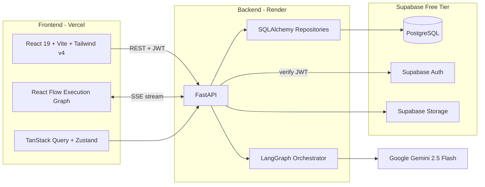
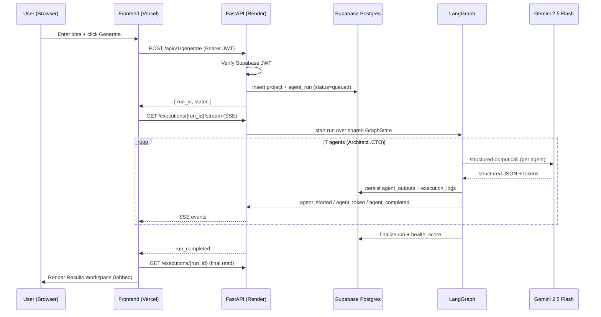
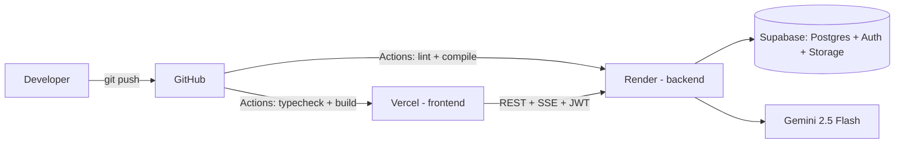

# Architecture

Blueprint AI is a multi-agent engineering intelligence platform that turns a
plain-language product idea into a complete engineering blueprint. This document
describes the high-level system, the request lifecycle, the runtime topology,
and the cross-cutting concerns (auth, streaming, resilience, deployment).

> **Tagline:** _Transform Product Ideas Into Engineering Execution._

Related docs: [SCHEMA](./SCHEMA.md) · [API](./API.md) ·
[LANGGRAPH](./LANGGRAPH.md) · [FRONTEND](./FRONTEND.md) · [ROADMAP](./ROADMAP.md)

---

## 1. System overview

The platform is split into three independently deployable concerns:

- **Frontend (Vercel)** — a React 19 SPA built with Vite. It calls the backend
  over REST (with a Supabase JWT bearer token), opens an SSE connection to watch
  an agent run live, and caches server state with TanStack Query while keeping
  transient execution UI state in Zustand.
- **Backend (Render)** — a FastAPI service that owns business logic, persistence
  (via SQLAlchemy repositories), JWT verification, and the LangGraph
  orchestrator that drives the 7-agent pipeline against Google Gemini.
- **Supabase (free tier)** — managed PostgreSQL (with Row Level Security), Auth
  (issues/validates user JWTs), and Storage.

The only external AI dependency is **Google Gemini 2.5 Flash** (free tier). The
entire stack is free and contains **no paid dependencies and no OpenAI**.

---

## 2. Request lifecycle

A generation run follows a single, predictable path:

**Summary:** user submits idea → `POST /generate` creates a `project` + an
`agent_run` → LangGraph runs 7 agents sequentially over shared state → each agent
streams progress/tokens via SSE and persists `agent_outputs` + `execution_logs`
→ the frontend renders the live React Flow graph, then the Results Workspace
reads the persisted outputs.

---

## 3. Components

### Frontend
- **App shell & providers:** Router, TanStack Query provider, dark-first theme
  provider, Supabase auth provider, and an `AppShell` (sidebar + topbar).
- **Feature modules:** `landing`, `dashboard`, `execution` (React Flow + SSE),
  `workspace` (tabbed results), `projects`, `auth`.
- **Visualization:** React Flow for the live execution graph and architecture
  diagrams, Recharts for analytics, Monaco for code blocks.
- See [FRONTEND.md](./FRONTEND.md) for the full component hierarchy and state
  strategy.

### Backend
- **API layer** (`api/v1/routers/`): projects, generate, executions, history,
  agents, health.
- **Schemas** (`schemas/`): Pydantic v2 request/response models, mirrored into
  TypeScript types on the frontend.
- **Models** (`models/`): SQLAlchemy ORM mapped to the Supabase Postgres schema.
- **Repositories** (`repositories/`): the only place that touches the database;
  injected into services via FastAPI dependencies.
- **Services** (`services/`): `project_service`, `execution_service` — orchestrate
  repositories and the agent pipeline.
- **Agents** (`agents/`): LangGraph `graph.py`, `state.py`, `nodes/`, `prompts/`.
  See [LANGGRAPH.md](./LANGGRAPH.md).
- **Core** (`core/`): config, security (JWT verify), DI dependencies, logging.

### Data
- PostgreSQL schema, enums, FKs, and RLS are documented in [SCHEMA.md](./SCHEMA.md).
- Alembic owns migrations.

---

## 4. Cross-cutting concerns

### Authentication
- **Supabase Auth** issues JWTs to the browser. The frontend attaches the token
  as `Authorization: Bearer <jwt>` on every REST call and on the SSE request.
- FastAPI **verifies** the Supabase JWT (signature + claims) in `core/security`
  and resolves the current user from the `sub` claim, which equals
  `users.id` (= `auth.users.id`).
- The backend uses the Supabase **service role** for trusted server-side writes,
  bypassing RLS where appropriate (see [SCHEMA.md](./SCHEMA.md)).

### Real-time streaming (SSE)
- Live agent progress is delivered over **Server-Sent Events** at
  `GET /executions/{run_id}/stream`.
- Event types: `agent_started`, `agent_token`, `agent_completed`,
  `run_completed`, `error`.
- Canonical event shape: `{ type, agent, run_id, payload, ts }`.
- SSE was chosen over WebSockets because the stream is unidirectional
  (server → client), works over plain HTTP, auto-reconnects, and is trivial to
  host on Render's free tier. See [API.md](./API.md) for full event payloads.

### Persistence model
- Every run persists incrementally: `agent_outputs` (one structured row per
  agent, unique per `run_id`+`agent`) and `execution_logs` (append-only).
- Because outputs persist as agents complete, **partial results survive
  failures** and the workspace can still render whatever finished.

### Resilience
- Each LangGraph node is wrapped in try/except. On failure the agent is marked
  `failed`, an `error`-level log is emitted, and the orchestrator either
  continues with degraded state or aborts the run — partial outputs remain.
- The frontend handles `error` SSE events and renders failed nodes distinctly in
  the execution graph.

### Configuration
- All secrets/config come from environment variables (never committed):
  `DATABASE_URL`, `SUPABASE_JWT_SECRET`/JWKS, `GEMINI_API_KEY`, `CORS_ORIGINS`
  on the backend; `VITE_API_URL`, `VITE_SUPABASE_URL`, `VITE_SUPABASE_ANON_KEY`
  on the frontend.

---

## 5. Deployment topology (free tier)

- **Vercel** hosts the static frontend build (root directory `frontend/`).
- **Render** hosts the FastAPI service (root directory `backend/`). Free web
  services sleep when idle; the frontend periodically calls `GET /health` to keep
  the instance warm.
- **Supabase** provides Postgres + Auth + Storage on the free tier; migrations
  are applied with `alembic upgrade head`.
- **GitHub Actions** runs the two CI workflows (`ci-frontend.yml`,
  `ci-backend.yml`) on every push/PR.

See the repository [`README.md`](../README.md) for step-by-step deployment.
