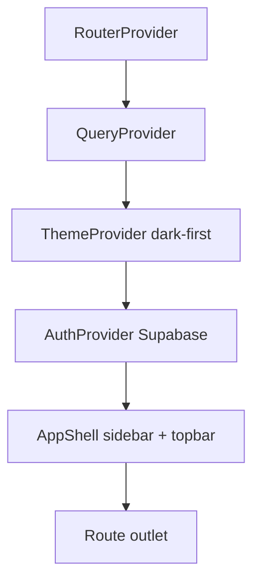
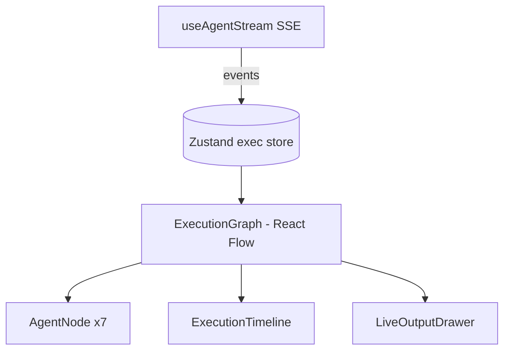
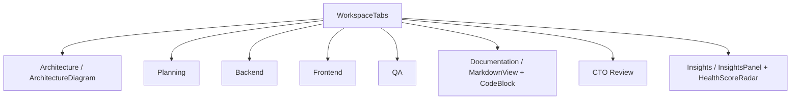
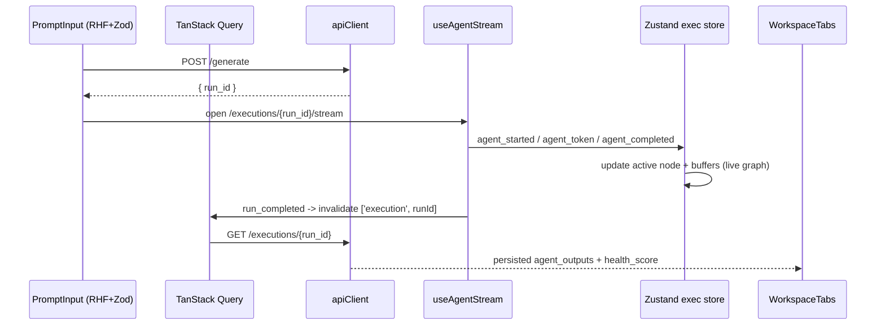

# Frontend

A React 19 single-page app built with Vite and TypeScript, styled with Tailwind
CSS v4 + shadcn/ui, animated with Framer Motion, and organized by **feature
module**. Server state is cached with TanStack Query; transient execution UI
state lives in Zustand; forms use React Hook Form + Zod.

Lives under `frontend/src/`.

Related docs: [ARCHITECTURE](./ARCHITECTURE.md) · [API](./API.md) ·
[LANGGRAPH](./LANGGRAPH.md)

---

## App shell & providers (`app/`)

The application is wrapped, outermost to innermost, by:

- `RouterProvider` — client-side routing.
- `QueryProvider` — TanStack Query client (server-state cache).
- `ThemeProvider` — **dark-first** theme.
- `AuthProvider` — Supabase Auth session + JWT, exposes the current user.
- `AppShell` — persistent layout: sidebar (nav) + topbar (user, theme toggle).

---

## Routes

| Path                | Screen                | Notes                                   |
| ------------------- | --------------------- | --------------------------------------- |
| `/`                 | Landing               | public; hero + prompt input             |
| `/login`            | Auth                  | Supabase sign-in                        |
| `/dashboard`        | Dashboard             | projects, recent runs, analytics        |
| `/projects/:id`     | Project detail        | project + latest run summary            |
| `/executions/:runId`| Live execution graph  | React Flow + SSE stream                 |
| `/workspace/:runId` | Results workspace     | tabbed persisted outputs                |

Protected routes (everything except `/` and `/login`) require an authenticated
Supabase session.

---

## Component hierarchy by feature

### `landing/`
`Hero` (typing effect) · `GradientMesh` · `FloatingParticles` · `FeatureGrid` ·
`ArchitectureShowcase` · `PromptInput` + `GenerateButton` · `CTA`.

### `dashboard/`
`ProjectCard` · `RecentGenerations` · `HealthScoreWidget` · `AgentMetrics` ·
`UsageAnalytics` (Recharts).

### `execution/`
`ExecutionGraph` (React Flow) · `AgentNode` (glow / status / tokens / timing) ·
`useAgentStream` (SSE hook) · `LiveOutputDrawer` · `ExecutionTimeline`.

### `workspace/`
`WorkspaceTabs` with tabs: **Architecture, Planning, Backend, Frontend, QA,
Documentation, CTO Review, Insights**.

- `ArchitectureDiagram` (React Flow)
- `MarkdownView` (React Markdown)
- `CodeBlock` (Monaco)
- `InsightsPanel` — risks, costs, team, timeline, `HealthScoreRadar`.

### `projects/`
Project list/detail views and create flow (consumes `/projects` endpoints).

### `auth/`
Supabase sign-in/up screens and the session bridge used by `AuthProvider`.

### `components/ui/`
shadcn/ui primitives (button, card, dialog, tabs, input, ...).

### `components/shared/`
`GlassCard` · `AnimatedCounter` · `Skeletons` · `PageTransition` · a Framer
Motion **variants library** reused across features.

---

## Supporting directories

| Directory   | Responsibility                                                        |
| ----------- | --------------------------------------------------------------------- |
| `lib/`      | `apiClient` (REST + JWT), `sseClient`, `supabaseClient`, `utils`      |
| `stores/`   | Zustand stores (execution UI state)                                   |
| `types/`    | shared TS types mirroring backend Pydantic schemas                    |
| `hooks/`    | reusable hooks (incl. data hooks built on TanStack Query)             |

---

## State strategy

| Concern                         | Tool                          |
| ------------------------------- | ----------------------------- |
| Server cache (projects, runs, history, documents) | **TanStack Query** |
| Live execution UI (active node, stream buffer, per-agent status) | **Zustand** |
| Prompt / forms + validation     | **React Hook Form + Zod**     |
| Auth session + JWT              | **Supabase Auth** (`AuthProvider`) |

- **TanStack Query** owns everything fetched from the REST API, with cache keys
  per resource (`['projects']`, `['project', id]`, `['execution', runId]`,
  `['history']`, `['documents', runId]`) and invalidation after mutations
  (create project, generate, re-run agent, delete).
- **Zustand** holds ephemeral execution state driven by the `useAgentStream` SSE
  hook: which `AgentNode` is active, per-agent status/tokens/timing, and the live
  token buffer for `LiveOutputDrawer`. When the run completes, the workspace
  reads the **persisted** result via TanStack Query rather than the live buffer.
- **Forms:** the landing `PromptInput` and project create form use React Hook
  Form with Zod schemas that mirror the backend request shapes in
  [API.md](./API.md).

---

## Data flow: generate → live → results

---

## Conventions

- **Dark-first** theme; Tailwind v4 design tokens drive color/spacing.
- Framer Motion `PageTransition` wraps route changes; shared variants keep
  animations consistent.
- All API types are generated/mirrored from the backend Pydantic schemas in
  `types/` so the contract in [API.md](./API.md) stays in sync.
