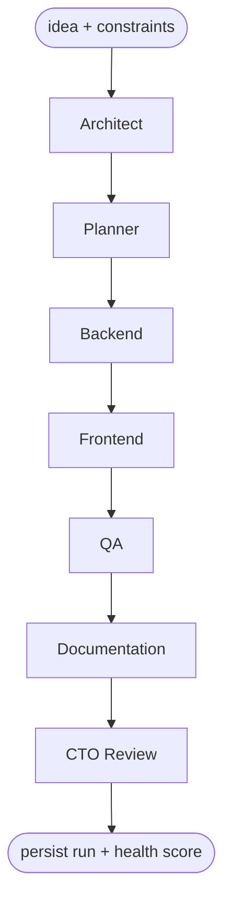
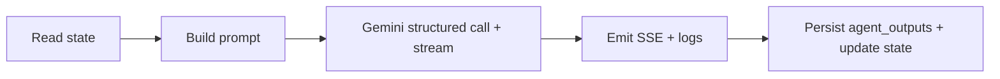

# LangGraph Workflow

The generation pipeline is a **sequential LangGraph** over a single shared,
typed state object. Each node is one Google **Gemini 2.5 Flash** call that
produces **structured output** (a Pydantic schema per agent), streams progress
via SSE, and appends `execution_logs`. The final CTO node reads everything and
emits the run-level estimates.

Lives in `backend/app/agents/`: `graph.py` (graph wiring), `state.py`
(`GraphState`), `nodes/` (one node per agent), `prompts/` (one prompt file per
agent).

Related docs: [ARCHITECTURE](./ARCHITECTURE.md) · [API](./API.md) ·
[SCHEMA](./SCHEMA.md)

---

## Graph topology

The graph is strictly sequential: each node reads prior outputs from shared
state and writes its own slice. The CTO node consumes all upstream outputs.

---

## GraphState (`agents/state.py`)

A `TypedDict`/Pydantic state passed through every node. Fields:

| Field             | Type                         | Written by    | Notes                                   |
| ----------------- | ---------------------------- | ------------- | --------------------------------------- |
| `run_id`          | `str (uuid)`                 | orchestrator  | identifies the persisted run            |
| `idea`            | `str`                        | orchestrator  | raw idea prompt                         |
| `constraints`     | `dict / ParsedConstraints`   | orchestrator  | parsed constraints (from feature_request) |
| `architecture`    | `ArchitectureOutput | None`  | Architect     | system design                           |
| `plan`            | `PlanOutput | None`          | Planner       | epics/stories/tasks + estimates         |
| `backend`         | `BackendOutput | None`       | Backend       | API + data + service design             |
| `frontend`        | `FrontendOutput | None`      | Frontend      | routes + components + state             |
| `qa`              | `QAOutput | None`            | QA            | test strategy + risks                   |
| `documentation`   | `DocumentationOutput | None` | Documentation | generated markdown docs                 |
| `cto_review`      | `CTOReviewOutput | None`     | CTO Review    | health/cost/team/delivery               |
| `total_tokens`    | `int`                        | all nodes     | accumulator                             |
| `total_duration_ms` | `int`                      | all nodes     | accumulator                             |
| `errors`          | `list[AgentError]`           | all nodes     | per-node failures (resilience)          |

Each node appends its `tokens`/`duration_ms` to the accumulators after its call.

---

## Node contract

Every agent node follows the same shape:

1. **Read** the relevant upstream fields from `GraphState`.
2. **Build prompt** from `agents/prompts/<agent>.py` + the read inputs.
3. **Call Gemini** with a per-agent **structured output** Pydantic schema and a
   streaming callback.
4. **Stream** `agent_started` → `agent_token`* → `agent_completed` SSE events
   and append matching `execution_logs`.
5. **Persist** the structured result into `agent_outputs` (upsert on
   `run_id`+`agent`) and **write** the field back into `GraphState`.

---

## Per-agent inputs, outputs & structured schemas

### 1. Architect (`architect`)
- **Inputs:** `idea`, `constraints`.
- **Output (`ArchitectureOutput`):**
  - `summary: str`
  - `components: [{ name, responsibility, tech }]`
  - `data_flows: [{ from, to, description }]`
  - `tech_stack: { frontend, backend, database, infra, ai }`
  - `diagram_mermaid: str` (flowchart)

### 2. Planner (`planner`)
- **Inputs:** `idea`, `constraints`, `architecture`.
- **Output (`PlanOutput`):**
  - `epics: [{ id, title, description, stories: [{ id, title, tasks: [{ id, title, estimate_points }] }] }]`
  - `milestones: [{ name, deliverables, target_week }]`
  - `total_story_points: int`

### 3. Backend (`backend`)
- **Inputs:** `architecture`, `plan`.
- **Output (`BackendOutput`):**
  - `services: [{ name, responsibility }]`
  - `data_models: [{ name, fields: [{ name, type, notes }] }]`
  - `endpoints: [{ method, path, description, auth }]`
  - `notes_md: str`

### 4. Frontend (`frontend`)
- **Inputs:** `architecture`, `plan`, `backend`.
- **Output (`FrontendOutput`):**
  - `routes: [{ path, purpose }]`
  - `components: [{ name, type, props_summary }]`
  - `state_strategy: str`
  - `notes_md: str`

### 5. QA (`qa`)
- **Inputs:** `architecture`, `plan`, `backend`, `frontend`.
- **Output (`QAOutput`):**
  - `test_strategy: str`
  - `test_cases: [{ area, scenario, type }]` (`unit|integration|e2e`)
  - `risks: [{ description, severity, mitigation }]`

### 6. Documentation (`documentation`)
- **Inputs:** all prior outputs.
- **Output (`DocumentationOutput`):**
  - `documents: [{ doc_type, title, content_md }]`
    (`doc_type` ∈ `spec|developer_guide|deployment_plan|notes`)
- Persisted both to `agent_outputs` and to the `generated_documents` table.

### 7. CTO Review (`cto_review`)
- **Inputs:** the entire `GraphState`.
- **Output (`CTOReviewOutput`):**
  - `summary: str`
  - `health_score: { overall: int, categories: { feasibility, scalability, security, maintainability, cost_efficiency } }`
  - `cost_estimation: { monthly_usd_low, monthly_usd_high, drivers: [str] }`
  - `team_estimation: { roles: [{ role, count }], total_headcount }`
  - `delivery_estimation: { weeks_low, weeks_high, assumptions: [str] }`
  - `recommendations: [str]`
  - `risks: [{ description, severity }]`

The CTO node's `health_score` is also written to `agent_runs.health_score`, and
the cost/team/delivery sub-objects drive the workspace **Insights** panel.

---

## Structured output & streaming

- Each Gemini call requests a **structured response** matching the agent's
  Pydantic schema, so outputs are reliably parseable JSON (no free-text
  scraping).
- A streaming callback forwards incremental text as `agent_token` SSE events and
  writes periodic `execution_logs` rows. See [API.md](./API.md) for the exact
  SSE event envelope and types.
- Token and timing data per call feed the run accumulators
  (`total_tokens`, `total_duration_ms`) and the per-agent
  `agent_outputs.tokens` / `duration_ms`.

---

## Resilience

- Every node is wrapped in **try/except**. On failure:
  1. mark that agent's `agent_outputs.status = failed`,
  2. append an `error`-level `execution_log` and an `error` SSE event,
  3. record the failure in `GraphState.errors`.
- The orchestrator then either **continues** with degraded downstream prompts
  (preferred, so the run yields partial value) or **aborts** for fatal errors.
- Because outputs persist incrementally, **partial results always survive** and
  the Results Workspace renders whatever completed.
- On full-run failure the run is finalized with `status = failed` and a
  top-level `agent_runs.error` message; a `run_completed`/`error` SSE event is
  emitted so the client can stop listening.

---

## Why Gemini (and not OpenAI)

The project is intentionally **free-tier only with no OpenAI dependency**.
Google **Gemini 2.5 Flash** provides fast, low-cost (free-tier) structured
generation with streaming, which fits the sequential multi-agent pipeline and
the SSE-driven live UI.
