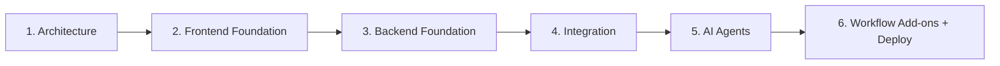

# Development Roadmap

Blueprint AI is built incrementally — **no big-bang**. Each phase produces
something runnable and de-risks the next. The frontend is built first on mock
data so the experience can be designed end-to-end before any backend or AI
exists; the backend then comes online stubbed, gets wired up, and only then are
the real AI agents introduced.

Related docs: [ARCHITECTURE](./ARCHITECTURE.md) · [SCHEMA](./SCHEMA.md) ·
[API](./API.md) · [LANGGRAPH](./LANGGRAPH.md) · [FRONTEND](./FRONTEND.md)

---

## Phase 1 — Architecture (this documentation)

Finalize the design contract before writing code.

- Lock folder structure, database schema, API contracts, the LangGraph
  workflow, and the frontend component hierarchy.
- **Output:** the `docs/` set (ARCHITECTURE, SCHEMA, API, LANGGRAPH, FRONTEND,
  ROADMAP) plus repository scaffolding (`README`, `.gitignore`, CI workflows).
- **No application code.**

---

## Phase 2 — Frontend Foundation

Build the full experience on **mock data**.

- Vite + React 19 + TypeScript + Tailwind v4 + shadcn/ui.
- Routing + dark theme + `AppShell`.
- Landing, Dashboard, Execution screen, and Workspace all working against mock
  data with **full Framer Motion animations**.
- React Flow execution graph and architecture diagrams render from fixtures.
- **Exit criteria:** every screen is navigable and animated end-to-end without a
  backend.

---

## Phase 3 — Backend Foundation

Stand up the API and persistence — **no AI yet (stubbed runs)**.

- FastAPI skeleton with the `/api/v1` routers.
- Supabase Postgres + SQLAlchemy models + **Alembic** migrations matching
  [SCHEMA.md](./SCHEMA.md).
- Repositories + services, project & execution storage, execution logging.
- `POST /generate` creates runs and emits **stubbed** SSE events on a timer so
  the live UI can be exercised.
- **Exit criteria:** projects and runs persist; the SSE stream works with stub
  data.

---

## Phase 4 — Integration

Wire the frontend to the real backend and replace mocks.

- TanStack Query data layer against the real endpoints.
- Supabase **Auth + JWT verify** end-to-end (frontend session → backend
  verification).
- Error/loading states, caching, and persistence.
- Replace all mock fixtures with live data.
- **Exit criteria:** an authenticated user can create a project and watch a
  (still-stubbed) run drive the live UI from real persisted data.

---

## Phase 5 — AI Agents

Introduce the real intelligence.

- Google **Gemini 2.5 Flash** + **LangGraph** 7-agent pipeline
  (Architect → Planner → Backend → Frontend → QA → Documentation → CTO Review).
- **Structured outputs** per agent, real **SSE streaming** of tokens.
- Health / cost / team / delivery estimation from the CTO node.
- Real-time React Flow graph driven by actual agent events.
- **Exit criteria:** a real idea produces a full, persisted blueprint rendered in
  the Results Workspace. See [LANGGRAPH.md](./LANGGRAPH.md).

---

## Phase 6 — Workflow Add-ons + Deploy

Ship it and add export workflows.

- **Generate Jira Tickets** (`POST /export/jira`) and **Export to GitHub
  Issues** (`POST /export/github-issues`) from the Planner's Epics/Stories/Tasks.
- Deploy: **Vercel** (frontend) + **Render** (backend) + **Supabase**
  (DB/Auth/Storage), all free tier.
- **GitHub Actions** CI (`ci-frontend.yml`, `ci-backend.yml`) gating every
  push/PR.
- **Exit criteria:** the app is live on free infrastructure with CI green and
  export workflows functional.

---

## Phase summary

| Phase | Focus               | Key output                                   | AI?      |
| ----- | ------------------- | -------------------------------------------- | -------- |
| 1     | Architecture        | `docs/` + scaffolding                        | —        |
| 2     | Frontend Foundation | UI on mock data, fully animated              | —        |
| 3     | Backend Foundation  | FastAPI + Supabase + migrations (stubbed)    | stubbed  |
| 4     | Integration         | wired FE↔BE, Supabase Auth, mocks replaced   | stubbed  |
| 5     | AI Agents           | Gemini + LangGraph pipeline, SSE, estimates  | **real** |
| 6     | Add-ons + Deploy    | Jira/GitHub export, live deploy + CI         | real     |

> **Constraints across all phases:** completely free stack, **no paid
> dependencies**, and **no OpenAI** — generation uses Google Gemini's free tier.
