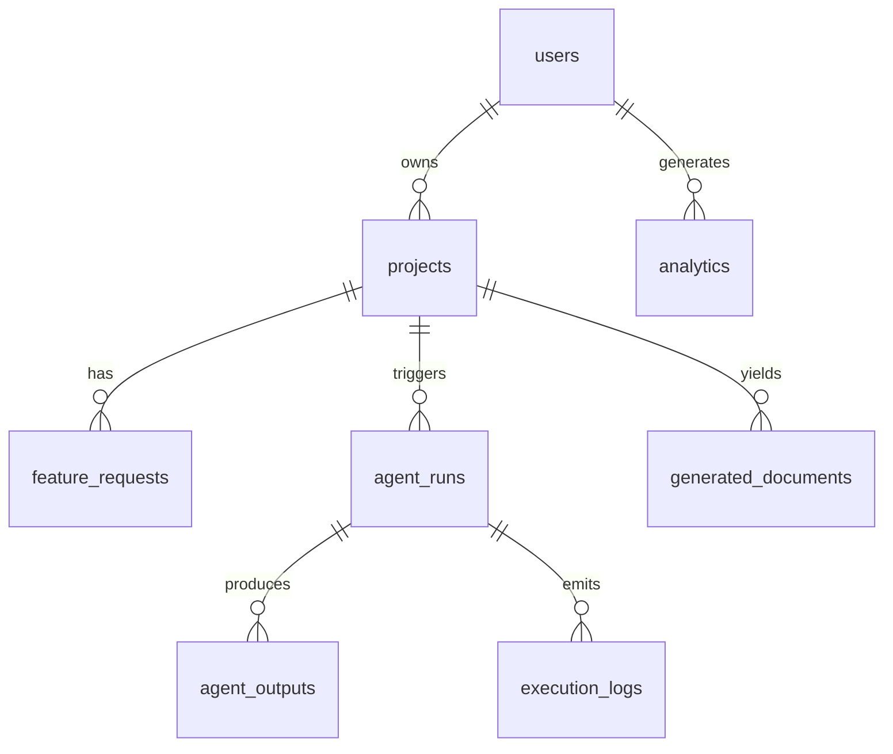

# Database Schema

PostgreSQL, hosted on **Supabase (free tier)**, accessed from FastAPI through
SQLAlchemy with Alembic-managed migrations.

Conventions for every table:

- Primary key `id` is a `uuid` (default `gen_random_uuid()`), except `users.id`
  which mirrors the Supabase Auth user id (`auth.users.id`).
- Timestamp columns are `timestamptz`. Most tables carry `created_at` (default
  `now()`); mutable tables also carry `updated_at`.
- All cross-table references are real foreign keys with `ON DELETE CASCADE`
  unless noted otherwise.
- **Row Level Security (RLS)** is enabled on every table; policies scope rows to
  the owning user. The FastAPI **service role** bypasses RLS for trusted
  server-side writes.

Related docs: [ARCHITECTURE](./ARCHITECTURE.md) · [API](./API.md) ·
[LANGGRAPH](./LANGGRAPH.md)

---

## Entity-relationship diagram

---

## Enumerated types

| Enum                | Values                                                                    |
| ------------------- | ------------------------------------------------------------------------- |
| `project_status`    | `draft`, `running`, `completed`, `failed`                                 |
| `run_status`        | `queued`, `running`, `completed`, `failed`                                |
| `agent_output_status` | `queued`, `running`, `completed`, `failed`                              |
| `agent_kind`        | `architect`, `planner`, `backend`, `frontend`, `qa`, `documentation`, `cto_review` |
| `log_level`         | `info`, `warn`, `error`                                                   |
| `doc_type`          | `spec`, `developer_guide`, `deployment_plan`, `notes`                     |

> Enums are implemented as native Postgres `ENUM` types and mirrored as Python
> `enum.Enum` (backend) and TypeScript string-literal unions (frontend).

---

## Tables

### `users`
Mirrors the Supabase Auth user. A row is created/synced on first authenticated
request.

| Column        | Type          | Constraints / notes                          |
| ------------- | ------------- | -------------------------------------------- |
| `id`          | `uuid`        | **PK**, equals `auth.users.id`               |
| `email`       | `text`        | not null, unique                             |
| `display_name`| `text`        | nullable                                     |
| `avatar_url`  | `text`        | nullable                                     |
| `created_at`  | `timestamptz` | not null, default `now()`                    |

### `projects`
A product idea and its lifecycle status.

| Column        | Type             | Constraints / notes                                  |
| ------------- | ---------------- | ---------------------------------------------------- |
| `id`          | `uuid`           | **PK**                                               |
| `user_id`     | `uuid`           | **FK → users.id**, not null, indexed                 |
| `name`        | `text`           | not null                                             |
| `idea_prompt` | `text`           | not null — the raw idea text                         |
| `status`      | `project_status` | not null, default `draft`                            |
| `created_at`  | `timestamptz`    | not null, default `now()`                            |
| `updated_at`  | `timestamptz`    | not null, default `now()` (auto-touch on update)     |

### `feature_requests`
Parsed/normalized constraints extracted from a project's prompt.

| Column              | Type          | Constraints / notes                       |
| ------------------- | ------------- | ----------------------------------------- |
| `id`                | `uuid`        | **PK**                                    |
| `project_id`        | `uuid`        | **FK → projects.id**, not null, indexed   |
| `raw_prompt`        | `text`        | not null                                  |
| `parsed_constraints`| `jsonb`       | nullable — structured constraints         |
| `created_at`        | `timestamptz` | not null, default `now()`                 |

### `agent_runs`
One execution of the 7-agent pipeline for a project.

| Column              | Type          | Constraints / notes                              |
| ------------------- | ------------- | ------------------------------------------------ |
| `id`                | `uuid`        | **PK**                                           |
| `project_id`        | `uuid`        | **FK → projects.id**, not null, indexed          |
| `status`            | `run_status`  | not null, default `queued`                       |
| `started_at`        | `timestamptz` | nullable — set when execution begins             |
| `finished_at`       | `timestamptz` | nullable — set on completion/failure             |
| `total_tokens`      | `integer`     | not null, default `0`                            |
| `total_duration_ms` | `integer`     | not null, default `0`                            |
| `health_score`      | `jsonb`       | nullable — CTO-produced health summary           |
| `error`             | `text`        | nullable — top-level failure message             |

### `agent_outputs`
The structured result of a single agent within a run. **Unique** per
(`run_id`, `agent`).

| Column        | Type                  | Constraints / notes                          |
| ------------- | --------------------- | -------------------------------------------- |
| `id`          | `uuid`                | **PK**                                       |
| `run_id`      | `uuid`                | **FK → agent_runs.id**, not null, indexed    |
| `agent`       | `agent_kind`          | not null                                     |
| `status`      | `agent_output_status` | not null, default `queued`                   |
| `output`      | `jsonb`               | nullable — the agent's structured output     |
| `tokens`      | `integer`             | not null, default `0`                        |
| `duration_ms` | `integer`             | not null, default `0`                        |
| `created_at`  | `timestamptz`         | not null, default `now()`                    |
|               |                       | **UNIQUE (`run_id`, `agent`)**               |

### `execution_logs`
Append-only log stream for a run (also the source of SSE `agent_token`/log
events).

| Column     | Type          | Constraints / notes                       |
| ---------- | ------------- | ----------------------------------------- |
| `id`       | `uuid`        | **PK**                                    |
| `run_id`   | `uuid`        | **FK → agent_runs.id**, not null, indexed |
| `agent`    | `agent_kind`  | nullable — null for run-level logs        |
| `level`    | `log_level`   | not null, default `info`                  |
| `message`  | `text`        | not null                                  |
| `meta`     | `jsonb`       | nullable — arbitrary structured context   |
| `ts`       | `timestamptz` | not null, default `now()`, indexed        |

### `generated_documents`
Markdown documents produced by the run (e.g. spec, developer guide).

| Column       | Type          | Constraints / notes                          |
| ------------ | ------------- | -------------------------------------------- |
| `id`         | `uuid`        | **PK**                                       |
| `project_id` | `uuid`        | **FK → projects.id**, not null, indexed      |
| `run_id`     | `uuid`        | **FK → agent_runs.id**, not null, indexed    |
| `doc_type`   | `doc_type`    | not null                                     |
| `title`      | `text`        | not null                                     |
| `content_md` | `text`        | not null — Markdown body                     |
| `created_at` | `timestamptz` | not null, default `now()`                    |

### `analytics`
Lightweight product/usage events.

| Column       | Type          | Constraints / notes                          |
| ------------ | ------------- | -------------------------------------------- |
| `id`         | `uuid`        | **PK**                                       |
| `user_id`    | `uuid`        | **FK → users.id**, not null, indexed         |
| `event_type` | `text`        | not null                                     |
| `project_id` | `uuid`        | **FK → projects.id**, nullable               |
| `run_id`     | `uuid`        | **FK → agent_runs.id**, nullable             |
| `props`      | `jsonb`       | nullable — event properties                  |
| `ts`         | `timestamptz` | not null, default `now()`, indexed           |

---

## Foreign-key summary

| Child table            | Column       | References        | On delete |
| ---------------------- | ------------ | ----------------- | --------- |
| `projects`             | `user_id`    | `users.id`        | CASCADE   |
| `feature_requests`     | `project_id` | `projects.id`     | CASCADE   |
| `agent_runs`           | `project_id` | `projects.id`     | CASCADE   |
| `agent_outputs`        | `run_id`     | `agent_runs.id`   | CASCADE   |
| `execution_logs`       | `run_id`     | `agent_runs.id`   | CASCADE   |
| `generated_documents`  | `project_id` | `projects.id`     | CASCADE   |
| `generated_documents`  | `run_id`     | `agent_runs.id`   | CASCADE   |
| `analytics`            | `user_id`    | `users.id`        | CASCADE   |
| `analytics`            | `project_id` | `projects.id`     | SET NULL  |
| `analytics`            | `run_id`     | `agent_runs.id`   | SET NULL  |

Recommended indexes follow the FK columns plus `execution_logs.ts` and
`analytics.ts` for time-ordered reads.

---

## Row Level Security (RLS)

RLS is **enabled on every table**. The platform has two access contexts:

1. **End user (Supabase Auth JWT).** Reaches data only through policies that
   compare the row's owner to `auth.uid()`. Users can read/write only their own
   projects and everything reachable from them.
2. **FastAPI service role.** A trusted server identity that **bypasses RLS** to
   perform writes during agent runs (inserting `agent_outputs`,
   `execution_logs`, finalizing `agent_runs`) where row ownership is enforced in
   application code instead.

### Policy intent per table

| Table                  | User-facing policy (per `auth.uid()`)                                            |
| ---------------------- | -------------------------------------------------------------------------------- |
| `users`                | A user may select/update only their own row (`id = auth.uid()`).                 |
| `projects`             | CRUD where `user_id = auth.uid()`.                                               |
| `feature_requests`     | Access where the parent project's `user_id = auth.uid()`.                        |
| `agent_runs`           | Access where the parent project's `user_id = auth.uid()`.                        |
| `agent_outputs`        | Read where the run's project belongs to `auth.uid()`; writes via service role.  |
| `execution_logs`       | Read where the run's project belongs to `auth.uid()`; writes via service role.  |
| `generated_documents`  | Read where the project belongs to `auth.uid()`; writes via service role.        |
| `analytics`            | Access where `user_id = auth.uid()`.                                             |

> **Ownership joins.** For child tables that don't carry `user_id` directly
> (e.g. `agent_outputs`, `execution_logs`), policies join back up the FK chain
> (`agent_runs → projects → user_id`) to determine ownership.

---

## Migrations

- Alembic owns all DDL under `backend/alembic/versions/`.
- Native Postgres enum types are created in the initial migration before the
  tables that reference them.
- RLS enablement and policies are applied as migration steps (raw SQL) so the
  database is reproducible from a clean Supabase project via `alembic upgrade head`.
